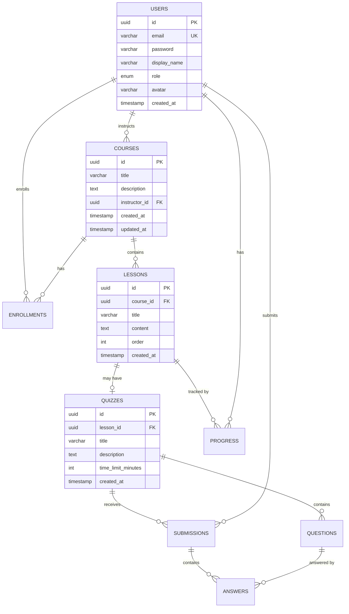
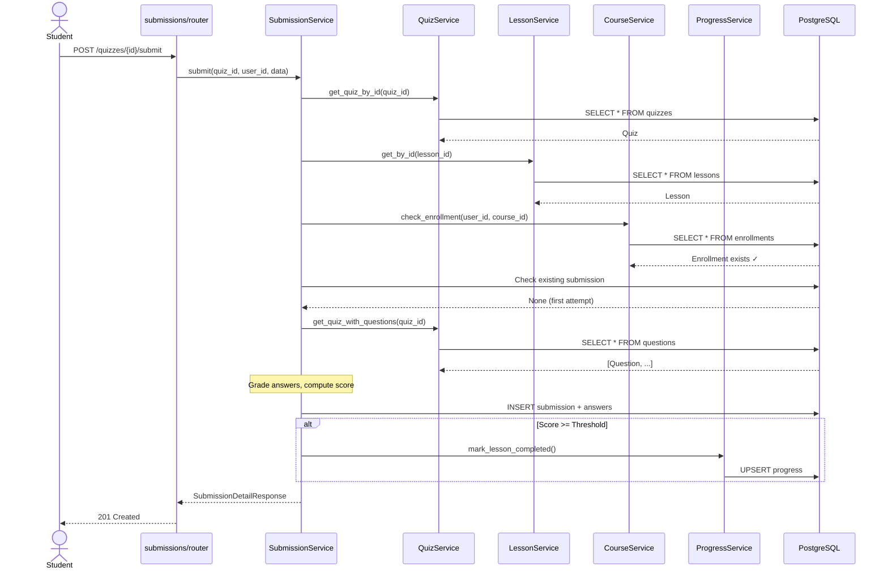

# Learning & Improvement Plan — AI-Enhanced Learning Platform

## May 27, 2026

---

# OVERVIEW

This document defines a structured learning and improvement plan for the **AI-Enhanced Learning Platform** codebase. It targets seven areas that are either missing or under-implemented in the current project. Each section explains **why** the topic matters, covers **core concepts**, provides **actionable steps** to apply them to this codebase, and cites **reference materials** for deeper study.

**Areas Covered**:

| # | Area | Current Status |
|---|---|---|
| 1 | Serializers (Pydantic Advanced) | Basic `from_attributes` only; no nested/computed/custom serializers |
| 2 | ACID & Transaction Management | No explicit transaction boundaries; `flush()` without `commit()` |
| 3 | Redis — Caching & Token Store | Planned in analysis but **not implemented** |
| 4 | Monitoring / Observability | `structlog` present; no metrics, tracing, or health-check depth |
| 5 | Diagrams | No ER diagram, sequence diagrams, or system design docs |
| 6 | AI for Data Generation & Testing | Manual test fixtures only; no AI-assisted generation |
| 7 | AI for Code Review | No pre-commit hooks, linters in CI, or AI review automation |

---

# 1. SERIALIZERS (Pydantic Advanced)

## 1.1 Why This Matters

Serializers are the **contract** between your API and its consumers. Poorly designed serializers lead to:

- **Over-fetching**: Exposing internal fields (e.g., `hashed_password`, `deleted_at`) to clients.
- **Under-fetching**: Forcing clients to make N+1 requests because nested relations aren't serialized.
- **Security leaks**: Accidentally exposing `correct_answer` in quiz questions to students.
- **Maintenance burden**: Duplicating serialization logic across services instead of centralizing it in schemas.

In the current codebase, serializers are simple flat Pydantic models with `from_attributes = True`. This works for basic CRUD but breaks down as the API grows.

## 1.2 Core Concepts

### A. Model Serializer vs Manual Schema

**Current approach** (manual schema):
```python
class CourseResponse(BaseModel):
    id: UUID
    title: str
    description: str | None
    instructor_id: UUID
    created_at: datetime
    updated_at: datetime | None

    model_config = {"from_attributes": True}
```

**Improved approach** (computed fields, nested serialization):
```python
from pydantic import computed_field

class CourseResponse(BaseModel):
    id: UUID
    title: str
    description: str | None
    instructor_id: UUID
    instructor_name: str | None = None  # Nested from relationship
    lesson_count: int = 0               # Computed/aggregated
    created_at: datetime

    model_config = {"from_attributes": True}

    @computed_field
    @property
    def is_recent(self) -> bool:
        """Courses created within the last 30 days."""
        from datetime import timedelta
        return (datetime.now(UTC) - self.created_at) < timedelta(days=30)
```

### B. Nested Serializers

When a client fetches a course, they often need the instructor's name and lesson titles too. Without nested serialization, this requires 3 API calls.

```python
class InstructorSummary(BaseModel):
    id: UUID
    display_name: str
    model_config = {"from_attributes": True}

class LessonSummary(BaseModel):
    id: UUID
    title: str
    order: int
    model_config = {"from_attributes": True}

class CourseDetailResponse(BaseModel):
    id: UUID
    title: str
    description: str | None
    instructor: InstructorSummary
    lessons: list[LessonSummary] = []
    model_config = {"from_attributes": True}
```

### C. Role-Based Serialization

Different roles should see different fields. For example, students should never see `correct_answer` in quiz questions.

```python
class QuestionStudentResponse(BaseModel):
    """Student view — correct_answer is hidden."""
    id: UUID
    text: str
    options: list[str]

class QuestionInstructorResponse(QuestionStudentResponse):
    """Instructor/Admin view — includes correct_answer."""
    correct_answer: str
```

### D. Custom Serializers with `model_serializer` / `field_serializer`

```python
from pydantic import field_serializer

class SubmissionResponse(BaseModel):
    id: UUID
    score: float
    submitted_at: datetime

    @field_serializer("score")
    def format_score(self, v: float) -> str:
        return f"{v:.1f}%"

    @field_serializer("submitted_at")
    def format_datetime(self, v: datetime) -> str:
        return v.strftime("%Y-%m-%d %H:%M UTC")
```

### E. Validation with `model_validator`

```python
from pydantic import model_validator

class CourseUpdateRequest(BaseModel):
    title: str | None = None
    description: str | None = None

    @model_validator(mode="after")
    def at_least_one_field(self):
        if not self.title and not self.description:
            raise ValueError("At least one field must be provided for update")
        return self
```

## 1.3 Action Items for This Project

1. **Add nested serialization** to `CourseResponse` (include `instructor_name`).
2. **Add role-based question serialization** — students get `QuestionStudentResponse`, instructors get `QuestionInstructorResponse`.
3. **Use `computed_field`** for derived data (e.g., `has_quiz` on `LessonResponse`, `enrollment_count` on `CourseResponse`).
4. **Add `model_validator`** to `CourseUpdateRequest` and `UserUpdateRequest` to reject empty patch bodies.
5. **Create a shared `TimestampMixin`** base schema for consistent datetime formatting.

## 1.4 References

- [Pydantic v2 — Serialization](https://docs.pydantic.dev/latest/concepts/serialization/)
- [Pydantic v2 — Computed Fields](https://docs.pydantic.dev/latest/concepts/fields/#computed-fields)
- [Pydantic v2 — Validators](https://docs.pydantic.dev/latest/concepts/validators/)
- [FastAPI — Response Model](https://fastapi.tiangolo.com/tutorial/response-model/)
- [FastAPI — Extra Models](https://fastapi.tiangolo.com/tutorial/extra-models/)

---

# 2. ACID & TRANSACTION MANAGEMENT

## 2.1 Why This Matters

ACID (Atomicity, Consistency, Isolation, Durability) properties guarantee that database operations are reliable. Without explicit transaction management:

- **Partial writes**: If quiz grading succeeds but progress update fails, data is inconsistent.
- **Dirty reads**: Concurrent requests can see half-written data.
- **Lost updates**: Two instructors updating the same course can overwrite each other's changes.

The current codebase uses `flush()` extensively but **never explicitly calls `commit()` or manages transaction boundaries**. The session's `commit()` appears to happen implicitly (likely via FastAPI dependency teardown), but this is fragile and undocumented.

## 2.2 Core Concepts

### A. ACID Properties Explained

| Property | Meaning | Example in This Project |
|---|---|---|
| **Atomicity** | All operations in a transaction succeed or all fail | Quiz submission: create `Submission` + N `Answer` rows + update `Progress` — all or nothing |
| **Consistency** | Database moves from one valid state to another | Enrollment count can never exceed the number of enrolled students |
| **Isolation** | Concurrent transactions don't interfere | Two students submitting quizzes simultaneously don't corrupt each other's scores |
| **Durability** | Once committed, data survives crashes | After a commit, the submission is permanently stored |

### B. Transaction Patterns in SQLAlchemy Async

**Pattern 1: Session-per-request with explicit commit (Recommended)**

```python
async def get_db() -> AsyncGenerator[AsyncSession, None]:
    async with async_session_factory() as session:
        try:
            yield session
            await session.commit()      # Commit on success
        except Exception:
            await session.rollback()    # Rollback on any error
            raise
```

**Pattern 2: Explicit transaction blocks for multi-step operations**

```python
async def submit_quiz(self, ...) -> SubmissionDetailResponse:
    async with self._db.begin():  # Explicit transaction
        # Step 1: Create submission
        submission = Submission(...)
        self._db.add(submission)
        await self._db.flush()

        # Step 2: Create answers
        for answer in answers:
            self._db.add(Answer(..., submission_id=submission.id))
        await self._db.flush()

        # Step 3: Update progress
        await self._progress_service.mark_completed(...)

        # Auto-commits when exiting `async with` block
        # Auto-rollbacks if any exception is raised
```

**Pattern 3: Nested transactions (savepoints)**

```python
async with session.begin_nested():  # Creates a SAVEPOINT
    try:
        # Try optional operation
        await send_notification(...)
    except NotificationError:
        pass  # Savepoint rolled back, outer transaction continues
```

### C. Isolation Levels

| Level | Dirty Read | Non-Repeatable Read | Phantom Read | Use Case |
|---|---|---|---|---|
| READ UNCOMMITTED | ✅ | ✅ | ✅ | Never use |
| READ COMMITTED | ❌ | ✅ | ✅ | PostgreSQL default — fine for most queries |
| REPEATABLE READ | ❌ | ❌ | ✅ | Financial/scoring operations |
| SERIALIZABLE | ❌ | ❌ | ❌ | Critical: enrollment limits, single-attempt quiz |

```python
# Per-session isolation level
engine = create_async_engine(
    DATABASE_URL,
    execution_options={"isolation_level": "REPEATABLE READ"}
)
```

### D. Optimistic vs Pessimistic Locking

**Optimistic locking** (version column):
```python
class Course(Base):
    __tablename__ = "courses"
    version: Mapped[int] = mapped_column(default=1)
    __mapper_args__ = {"version_id_col": version}
```

**Pessimistic locking** (SELECT ... FOR UPDATE):
```python
result = await session.execute(
    select(Course).where(Course.id == course_id).with_for_update()
)
```

## 2.3 Action Items for This Project

1. **Add explicit `commit()` / `rollback()`** in the `get_db()` dependency — replace the current bare `yield session`.
2. **Wrap `SubmissionService.submit()`** in an explicit transaction block (`async with session.begin()`) to guarantee atomicity across Submission + Answer + Progress updates.
3. **Add optimistic locking** (`version` column) to `Course` model for concurrent instructor updates.
4. **Use `SELECT ... FOR UPDATE`** in `EnrollmentRepository.get_enrollment()` to prevent duplicate enrollments under race conditions.
5. **Document transaction boundaries** in service docstrings.

## 2.4 References

- [SQLAlchemy — Session Basics (Async)](https://docs.sqlalchemy.org/en/20/orm/session_basics.html)
- [SQLAlchemy — Managing Transactions](https://docs.sqlalchemy.org/en/20/orm/session_transaction.html)
- [PostgreSQL — Transaction Isolation](https://www.postgresql.org/docs/16/transaction-iso.html)
- [FastAPI + SQLAlchemy — Dependency-Based Sessions](https://fastapi.tiangolo.com/tutorial/sql-databases/)
- [Martin Fowler — Unit of Work](https://martinfowler.com/eaaCatalog/unitOfWork.html)
- [Vlad Mihalcea — Optimistic Locking](https://vladmihalcea.com/optimistic-locking/)

---

# 3. REDIS — CACHING & TOKEN STORE

## 3.1 Why This Matters

Redis is listed in the Analysis Plan as a required technology but is **completely absent** from the codebase:

- **No `redis` or `aioredis` in `pyproject.toml`** — the dependency is not even installed.
- **No Redis service in `docker-compose.yml`** — the compose file runs PostgreSQL and MinIO only.
- **No token blacklist** — `POST /auth/logout` has no backing store; logout is effectively a no-op.
- **No caching** — every course list, lesson fetch, and quiz retrieval hits the database directly.

Without Redis:
- Logged-out tokens remain valid until they expire (security risk).
- The database is hammered on every read (scalability bottleneck).
- Rate limiter uses in-memory storage (resets on restart, doesn't work across multiple workers).

## 3.2 Core Concepts

### A. Redis as a Token Blacklist

When a user logs out, their JWT should be invalidated. Since JWTs are stateless, you need a **server-side blacklist**:

```python
# infrastructure/redis.py
import redis.asyncio as redis

redis_client: redis.Redis | None = None

async def init_redis(url: str) -> redis.Redis:
    global redis_client
    redis_client = redis.from_url(url, decode_responses=True)
    return redis_client

async def blacklist_token(jti: str, ttl_seconds: int) -> None:
    """Add a token's JTI to the blacklist with auto-expiry."""
    await redis_client.setex(f"blacklist:{jti}", ttl_seconds, "1")

async def is_token_blacklisted(jti: str) -> bool:
    """Check if a token has been revoked."""
    return await redis_client.exists(f"blacklist:{jti}") > 0
```

### B. Redis as a Cache Layer

**Cache-Aside Pattern** (most common):

```
Client → API → Check Redis Cache
                  ├── Cache HIT → Return cached data
                  └── Cache MISS → Query DB → Store in Redis → Return data
```

```python
import json

COURSE_CACHE_TTL = 300  # 5 minutes

async def get_course_cached(course_id: UUID) -> dict | None:
    cached = await redis_client.get(f"course:{course_id}")
    if cached:
        return json.loads(cached)
    return None

async def set_course_cache(course_id: UUID, data: dict) -> None:
    await redis_client.setex(
        f"course:{course_id}",
        COURSE_CACHE_TTL,
        json.dumps(data, default=str),
    )

async def invalidate_course_cache(course_id: UUID) -> None:
    await redis_client.delete(f"course:{course_id}")
```

### C. Cache Invalidation Strategies

| Strategy | How It Works | Pros | Cons |
|---|---|---|---|
| **TTL-based** | Cache expires after N seconds | Simple, self-healing | Stale data for TTL duration |
| **Write-through** | Update cache on every write | Always fresh | Complex, slower writes |
| **Write-behind** | Queue writes, batch update cache | Fast writes | Risk of data loss |
| **Event-driven** | Invalidate on model changes | Precise | Requires pub/sub setup |

### D. Redis for Rate Limiting

Replace the in-memory slowapi storage with Redis-backed storage for persistence across restarts:

```python
from slowapi import Limiter
from slowapi.util import get_remote_address

limiter = Limiter(
    key_func=get_remote_address,
    storage_uri="redis://localhost:6379/1",  # Use DB 1 for rate limits
)
```

## 3.3 Action Items for This Project

1. **Add `redis[hiredis]` to `pyproject.toml`** dependencies.
2. **Add a Redis service to `docker-compose.yml`** (port 6379).
3. **Add `REDIS_URL` to `Settings`** in `config.py`.
4. **Create `src/infrastructure/redis.py`** with connection management, token blacklist, and cache helpers.
5. **Implement token blacklist** in `AuthService.logout()` and check it in the `get_current_user` dependency.
6. **Add cache layer** for read-heavy endpoints: `GET /courses`, `GET /courses/{id}`, `GET /lessons/{id}`.
7. **Invalidate cache** on write operations (create, update, delete).
8. **Switch slowapi** to Redis-backed storage.
9. **Add Redis health check** to `GET /health`.

## 3.4 References

- [Redis Official Documentation](https://redis.io/docs/)
- [redis-py Async Guide](https://redis-py.readthedocs.io/en/stable/examples/asyncio_examples.html)
- [FastAPI + Redis Caching Tutorial](https://testdriven.io/blog/fastapi-redis/)
- [Cache-Aside Pattern — AWS](https://docs.aws.amazon.com/whitepapers/latest/database-caching-strategies-using-redis/cache-aside.html)
- [JWT Revocation Strategies](https://auth0.com/blog/denylist-json-web-token-api-keys/)
- [slowapi — Redis Backend](https://slowapi.readthedocs.io/en/latest/)

---

# 4. MONITORING / OBSERVABILITY

## 4.1 Why This Matters

Observability answers three questions about your production system:

1. **What is happening?** → Metrics (Prometheus)
2. **Why is it happening?** → Traces (OpenTelemetry / Jaeger)
3. **What happened?** → Logs (structlog — already partially set up)

The current codebase has `structlog` configured for structured logging but:

- **No metrics collection** — no request counts, latency histograms, error rates.
- **No distributed tracing** — no request IDs propagated across services.
- **Shallow health check** — `/health` returns `{"status": "healthy"}` without checking DB or Redis connectivity.
- **No request logging middleware** — no logs for incoming requests, response times, or status codes.

Without observability, debugging production issues is like flying blind.

## 4.2 Core Concepts

### A. The Three Pillars of Observability

```
                ┌──────────┐
                │  Alerts  │  ← Triggered by metrics exceeding thresholds
                └────┬─────┘
                     │
    ┌────────────────┼────────────────┐
    │                │                │
┌───▼───┐      ┌────▼────┐     ┌─────▼─────┐
│ Logs  │      │ Metrics │     │  Traces   │
│(What) │      │ (How    │     │ (Why)     │
│       │      │  much)  │     │           │
└───────┘      └─────────┘     └───────────┘
structlog      Prometheus      OpenTelemetry
               + Grafana       + Jaeger
```

### B. Key Metrics to Track

| Metric | Type | Description |
|---|---|---|
| `http_requests_total` | Counter | Total requests by method, path, status |
| `http_request_duration_seconds` | Histogram | Response time distribution |
| `db_query_duration_seconds` | Histogram | Database query latency |
| `active_connections` | Gauge | Current DB connection pool size |
| `cache_hits_total` / `cache_misses_total` | Counter | Redis cache hit ratio |
| `auth_login_total` | Counter | Login attempts (success/failure) |
| `quiz_submissions_total` | Counter | Quiz submissions by pass/fail |

### C. Implementing Prometheus Metrics in FastAPI

```python
# infrastructure/metrics.py
from prometheus_client import Counter, Histogram, generate_latest
from starlette.middleware.base import BaseHTTPMiddleware

REQUEST_COUNT = Counter(
    "http_requests_total",
    "Total HTTP requests",
    ["method", "path", "status"]
)

REQUEST_LATENCY = Histogram(
    "http_request_duration_seconds",
    "HTTP request latency",
    ["method", "path"]
)

class MetricsMiddleware(BaseHTTPMiddleware):
    async def dispatch(self, request, call_next):
        import time
        start = time.perf_counter()
        response = await call_next(request)
        duration = time.perf_counter() - start

        REQUEST_COUNT.labels(
            method=request.method,
            path=request.url.path,
            status=response.status_code,
        ).inc()
        REQUEST_LATENCY.labels(
            method=request.method,
            path=request.url.path,
        ).observe(duration)

        return response
```

### D. Structured Request Logging Middleware

```python
# middleware/logging.py
import time
import uuid
import structlog

logger = structlog.get_logger()

class RequestLoggingMiddleware(BaseHTTPMiddleware):
    async def dispatch(self, request, call_next):
        request_id = str(uuid.uuid4())[:8]
        structlog.contextvars.bind_contextvars(request_id=request_id)

        start = time.perf_counter()
        response = await call_next(request)
        duration_ms = (time.perf_counter() - start) * 1000

        logger.info(
            "request_completed",
            method=request.method,
            path=request.url.path,
            status=response.status_code,
            duration_ms=round(duration_ms, 2),
        )
        response.headers["X-Request-ID"] = request_id
        return response
```

### E. Deep Health Check

```python
@app.get("/health", tags=["system"])
async def health_check(db: AsyncSession = Depends(get_db)):
    checks = {"status": "healthy"}

    # Database check
    try:
        await db.execute(text("SELECT 1"))
        checks["database"] = "ok"
    except Exception:
        checks["database"] = "error"
        checks["status"] = "degraded"

    # Redis check
    try:
        await redis_client.ping()
        checks["redis"] = "ok"
    except Exception:
        checks["redis"] = "error"
        checks["status"] = "degraded"

    status_code = 200 if checks["status"] == "healthy" else 503
    return JSONResponse(content=checks, status_code=status_code)
```

## 4.3 Action Items for This Project

1. **Add request logging middleware** with request IDs and duration tracking.
2. **Enhance `/health`** to check database and Redis connectivity.
3. **Add `prometheus-fastapi-instrumentator`** or manual Prometheus metrics.
4. **Add `/metrics` endpoint** for Prometheus scraping.
5. **Add Prometheus + Grafana services** to `docker-compose.yml`.
6. **Add OpenTelemetry tracing** (optional, for advanced learning).
7. **Create a Grafana dashboard** for request rate, latency, error rate (RED method).

## 4.4 References

- [Prometheus — Getting Started](https://prometheus.io/docs/introduction/overview/)
- [prometheus-fastapi-instrumentator](https://github.com/trallnag/prometheus-fastapi-instrumentator)
- [OpenTelemetry Python — Getting Started](https://opentelemetry.io/docs/languages/python/getting-started/)
- [Grafana — Dashboard Quickstart](https://grafana.com/docs/grafana/latest/getting-started/)
- [structlog — Bound Loggers & Context Variables](https://www.structlog.org/en/stable/contextvars.html)
- [The RED Method — Tom Wilkie](https://grafana.com/blog/2018/08/02/the-red-method-how-to-instrument-your-services/)
- [Google SRE Book — Monitoring](https://sre.google/sre-book/monitoring-distributed-systems/)

---

# 5. DIAGRAMS (Use Cases, Sequence/Flow, System Design)

## 5.1 Why This Matters

Diagrams are **communication tools**. They allow:

- **New team members** to understand the system in minutes instead of hours.
- **Code reviewers** to verify that implementation matches the design intent.
- **Stakeholders** to validate business logic before development begins.
- **You** to think through complex flows before writing code.

The current project has **no diagrams** — no ER diagram, no sequence diagrams, no system architecture diagram. The Analysis Plan references an ER diagram as a requirement but it was never created.

## 5.2 Core Concepts

### A. Types of Diagrams and When to Use Them

| Diagram Type | Purpose | Tool |
|---|---|---|
| **ER Diagram** | Database relationships and constraints | Mermaid, dbdiagram.io |
| **Use Case Diagram** | Actor-feature mapping | PlantUML, draw.io |
| **Sequence Diagram** | Request flow through layers | Mermaid |
| **System Architecture** | High-level component overview | draw.io, Excalidraw |
| **Flow Diagram** | Business logic decision trees | Mermaid |
| **Class Diagram** | Service/repository relationships | Mermaid |

### B. ER Diagram (Mermaid)



### C. Sequence Diagram — Quiz Submission Flow



### D. System Architecture Diagram

```
┌─────────────────────────────────────────────────────────────┐
│                        Client (Browser / Mobile)            │
└───────────────────────────────┬──────────────────────────────┘
                                │ HTTPS
                ┌───────────────▼───────────────┐
                │    Railway Reverse Proxy       │
                │    (TLS termination)           │
                └───────────────┬───────────────┘
                                │ HTTP
                ┌───────────────▼───────────────┐
                │    FastAPI Application         │
                │    ┌─────────────────────┐     │
                │    │ Middleware Pipeline  │     │
                │    │  - CORS             │     │
                │    │  - ProxyHeaders     │     │
                │    │  - Session          │     │
                │    │  - Rate Limiting    │     │
                │    │  - Request Logging  │     │  (TODO)
                │    │  - Metrics          │     │  (TODO)
                │    └─────────┬───────────┘     │
                │    ┌─────────▼───────────┐     │
                │    │ Router Layer (v1/v2) │     │
                │    └─────────┬───────────┘     │
                │    ┌─────────▼───────────┐     │
                │    │ Service Layer        │     │
                │    │  (Business Logic)    │     │
                │    └──┬──────┬──────┬────┘     │
                │       │      │      │          │
                └───────┼──────┼──────┼──────────┘
                        │      │      │
           ┌────────────▼┐ ┌───▼───┐ ┌▼────────────┐
           │ PostgreSQL  │ │ Redis │ │ MinIO / S3   │
           │  (Primary)  │ │(Cache)│ │  (Avatars)   │
           └─────────────┘ └───────┘ └──────────────┘
                (TODO: Redis)
```

### E. Use Case Diagram

```
┌──────────────────────────────────────────────────────────┐
│                  Learning Platform                       │
│                                                          │
│  ┌──────────┐                                            │
│  │ Student  │──── Enroll in Course                       │
│  │          │──── View Lesson (auto-complete if no quiz) │
│  │          │──── Submit Quiz                            │
│  │          │──── View Progress                          │
│  │          │──── Update Profile                         │
│  └──────────┘                                            │
│                                                          │
│  ┌───────────┐                                           │
│  │Instructor │──── Create/Update Course                  │
│  │           │──── Create/Update Lesson                  │
│  │           │──── Create/Update Quiz + Questions         │
│  └───────────┘                                           │
│                                                          │
│  ┌──────────┐                                            │
│  │  Admin   │──── Manage All Users                       │
│  │          │──── Manage All Courses/Lessons/Quizzes     │
│  │          │──── View All Submissions                   │
│  │          │──── Access SQLAdmin UI                     │
│  └──────────┘                                            │
└──────────────────────────────────────────────────────────┘
```

## 5.3 Action Items for This Project

1. **Create `docs/diagrams/` directory** for all diagram files.
2. **Create ER diagram** using Mermaid in a Markdown file (as shown above).
3. **Create sequence diagrams** for the three most complex flows: quiz submission, user registration + login, and lesson completion.
4. **Create system architecture diagram** using draw.io or Excalidraw.
5. **Create use case diagram** mapping roles to features.
6. **Add a flow diagram** for the grading/progress logic decision tree.
7. **Link all diagrams from `README.md`**.

## 5.4 References

- [Mermaid — Live Editor](https://mermaid.live/)
- [Mermaid — ER Diagrams](https://mermaid.js.org/syntax/entityRelationshipDiagram.html)
- [Mermaid — Sequence Diagrams](https://mermaid.js.org/syntax/sequenceDiagram.html)
- [PlantUML — Use Case Diagrams](https://plantuml.com/use-case-diagram)
- [draw.io (diagrams.net)](https://app.diagrams.net/)
- [C4 Model — Software Architecture](https://c4model.com/)
- [dbdiagram.io — Database Diagrams](https://dbdiagram.io/)

---

# 6. AI FOR DATA GENERATION & TESTING

## 6.1 Why This Matters

Writing test data and test cases manually is:

- **Time-consuming**: Each test fixture requires manually creating users, courses, lessons, quizzes, questions, enrollments, and progress records.
- **Incomplete**: Human-written tests tend to cover the "happy path" and miss edge cases.
- **Repetitive**: Test helper functions like `create_test_user()`, `create_test_course()`, etc. are boilerplate that follows predictable patterns.

AI can accelerate testing by:

- **Generating realistic sample data** (Faker + AI prompts).
- **Generating edge-case test scenarios** you might not think of.
- **Creating complete test suites** from API specifications.
- **Identifying untested code paths** from coverage reports.

## 6.2 Core Concepts

### A. AI-Assisted Test Data Generation

**Using Faker for Realistic Data:**

```python
# scripts/generate_sample_data.py
from faker import Faker

fake = Faker()

def generate_users(n: int = 50) -> list[dict]:
    users = []
    for _ in range(n):
        users.append({
            "email": fake.unique.email(),
            "display_name": fake.name(),
            "password": fake.password(length=12, special_chars=True),
            "role": fake.random_element(["student", "instructor"]),
        })
    return users

def generate_courses(instructor_ids: list, n: int = 20) -> list[dict]:
    subjects = ["Python", "JavaScript", "Data Science", "Machine Learning",
                "Web Development", "DevOps", "Cloud Computing"]
    courses = []
    for _ in range(n):
        subject = fake.random_element(subjects)
        courses.append({
            "title": f"{subject} {fake.random_element(['Fundamentals', 'Advanced', 'Masterclass'])}",
            "description": fake.paragraph(nb_sentences=3),
            "instructor_id": fake.random_element(instructor_ids),
        })
    return courses
```

**Using AI to Generate Edge-Case Data:**

Prompt template for Gemini / ChatGPT:
```
Given this Pydantic schema for course creation:
- title: str (min_length=1, max_length=255)
- description: str | None

Generate 20 edge-case test inputs that should test boundary conditions,
including: empty strings, max-length strings, Unicode characters, SQL injection
attempts, XSS payloads, very long descriptions, None vs empty string,
and special characters.

Output as a Python list of dicts.
```

### B. AI-Assisted Unit Test Generation

**Workflow**:

1. **Feed the AI your source code** (service/repository function).
2. **Ask it to generate pytest test cases** covering:
   - Happy path
   - Error paths (all exception branches)
   - Edge cases (empty inputs, boundary values)
   - Concurrency scenarios
3. **Review and customize** the generated tests.
4. **Run coverage** to find remaining gaps.

**Example prompt:**
```
Here is my SubmissionService.submit() method: [paste code]

Generate a comprehensive pytest test suite that covers:
1. Successful quiz submission with correct and incorrect answers
2. Already submitted (duplicate submission)
3. Student not enrolled
4. Missing answers for some questions
5. Extra answers for non-existent questions
6. Duplicate question IDs in answers
7. All answers correct (100% score)
8. All answers incorrect (0% score)
9. Score exactly at threshold (boundary)
10. Score one point below threshold

Use pytest + pytest-asyncio. Mock dependencies using unittest.mock.AsyncMock.
Follow the existing conftest.py pattern: [paste conftest.py]
```

### C. AI-Powered Coverage Gap Analysis

```bash
# Generate coverage report in JSON
uv run pytest tests/ --cov=src --cov-report=json

# Feed the uncovered lines to AI:
# "Here are the uncovered lines in src/submissions/service.py: 174-176, 195-202.
#  Here is the source code for those lines: [paste].
#  Generate test cases that will cover these specific lines."
```

### D. Property-Based Testing with Hypothesis

```python
from hypothesis import given, strategies as st

@given(
    score=st.floats(min_value=0, max_value=100),
    total=st.integers(min_value=1, max_value=1000),
)
def test_compute_score_properties(score, total):
    """Score is always between 0 and 100."""
    correct = int(score * total / 100)
    result = SubmissionService._compute_score(correct, total)
    assert 0 <= result <= 100
```

## 6.3 Action Items for This Project

1. **Create `scripts/generate_sample_data.py`** using Faker to generate realistic test data for all entities.
2. **Create a seeding script** (`scripts/seed_db.py`) that populates the dev database with sample data.
3. **Use AI to generate edge-case test inputs** for each Pydantic schema (validation boundary testing).
4. **Use AI to fill test coverage gaps** — run coverage, feed uncovered lines to AI, generate targeted tests.
5. **Add `hypothesis`** to dev dependencies for property-based testing of business logic (scoring, grading).
6. **Create a `Makefile`** or script that combines coverage + AI gap analysis.

## 6.4 References

- [Faker — Python](https://faker.readthedocs.io/en/stable/)
- [Hypothesis — Property-Based Testing](https://hypothesis.readthedocs.io/en/latest/)
- [pytest-cov — Coverage Plugin](https://pytest-cov.readthedocs.io/)
- [GitHub Copilot — Test Generation](https://docs.github.com/en/copilot/using-github-copilot/using-github-copilot-for-code-review)
- [Google — AI for Software Testing (Research)](https://research.google/pubs/pub46698/)
- [Gemini Code Assist — Generate Unit Tests](https://cloud.google.com/gemini/docs/codeassist/write-test-cases)

---

# 7. AI FOR CODE REVIEW BEFORE COMMIT

## 7.1 Why This Matters

Manual code review is essential but has limitations:

- **Inconsistency**: Different reviewers catch different things.
- **Speed**: Human reviewers are slow; PR review is often the bottleneck.
- **Blind spots**: Reviewers tend to focus on logic, missing style issues, security vulnerabilities, or performance anti-patterns.

AI-assisted code review complements human review by:

- **Catching common issues automatically** (unused imports, type errors, security risks).
- **Enforcing consistent code style** across the team.
- **Running before commit** (shift-left), catching issues before they reach PR.

The current project has **no pre-commit hooks, no CI pipeline, and no linting configuration** (Ruff is installed but not configured in CI).

## 7.2 Core Concepts

### A. Pre-Commit Hooks (Local Gate)

Pre-commit hooks run automatically before each `git commit`, catching issues before code even reaches the repository.

```yaml
# .pre-commit-config.yaml
repos:
  # Ruff — linting + formatting (replaces flake8, isort, black)
  - repo: https://github.com/astral-sh/ruff-pre-commit
    rev: v0.8.6
    hooks:
      - id: ruff
        args: [--fix]
      - id: ruff-format

  # Type checking
  - repo: https://github.com/pre-commit/mirrors-mypy
    rev: v1.14.1
    hooks:
      - id: mypy
        additional_dependencies: [pydantic, sqlalchemy[mypy], fastapi]

  # Security scanning
  - repo: https://github.com/PyCQA/bandit
    rev: 1.8.3
    hooks:
      - id: bandit
        args: [-r, src/, -ll]

  # General file checks
  - repo: https://github.com/pre-commit/pre-commit-hooks
    rev: v5.0.0
    hooks:
      - id: trailing-whitespace
      - id: end-of-file-fixer
      - id: check-yaml
      - id: check-added-large-files
      - id: detect-private-key
```

Setup:
```bash
uv add --dev pre-commit
uv run pre-commit install
uv run pre-commit run --all-files  # Test on existing code
```

### B. CI/CD Pipeline (Remote Gate)

GitHub Actions workflow that runs on every push and PR:

```yaml
# .github/workflows/ci.yml
name: CI

on:
  push:
    branches: [main, develop]
  pull_request:
    branches: [main]

jobs:
  lint:
    runs-on: ubuntu-latest
    steps:
      - uses: actions/checkout@v4
      - uses: astral-sh/setup-uv@v5
      - run: uv sync --frozen
      - run: uv run ruff check src/ tests/
      - run: uv run ruff format --check src/ tests/

  test:
    runs-on: ubuntu-latest
    steps:
      - uses: actions/checkout@v4
      - uses: astral-sh/setup-uv@v5
      - run: uv sync --frozen
      - run: uv run pytest tests/ --cov=src --cov-report=xml
      - uses: codecov/codecov-action@v4
        with:
          token: ${{ secrets.CODECOV_TOKEN }}

  security:
    runs-on: ubuntu-latest
    steps:
      - uses: actions/checkout@v4
      - uses: astral-sh/setup-uv@v5
      - run: uv sync --frozen
      - run: uv run bandit -r src/ -ll
```

### C. AI-Powered Code Review in CI

**Option 1: Gemini Code Assist (Free for public repos)**

```yaml
# .github/workflows/ai-review.yml
name: AI Code Review

on:
  pull_request:
    types: [opened, synchronize]

permissions:
  contents: read
  pull-requests: write

jobs:
  review:
    runs-on: ubuntu-latest
    steps:
      - uses: actions/checkout@v4
      - name: AI Review with Gemini
        uses: google/gemini-code-review-action@v1
        with:
          gemini_api_key: ${{ secrets.GEMINI_API_KEY }}
```

**Option 2: Custom AI Review Script (Local)**

```python
#!/usr/bin/env python3
"""scripts/ai_review.py — AI-powered pre-commit code review."""

import subprocess
import sys

def get_staged_diff() -> str:
    result = subprocess.run(
        ["git", "diff", "--cached", "--diff-filter=ACM", "--", "*.py"],
        capture_output=True, text=True
    )
    return result.stdout

def review_with_ai(diff: str) -> str:
    """Send diff to Gemini API for review."""
    import google.generativeai as genai

    genai.configure(api_key=os.environ["GEMINI_API_KEY"])
    model = genai.GenerativeModel("gemini-pro")

    prompt = f"""Review this Python code diff for a FastAPI project.
    Check for:
    1. Security issues (SQL injection, XSS, auth bypass)
    2. Performance concerns (N+1 queries, missing indexes)
    3. Missing error handling
    4. Type safety issues
    5. FastAPI/Pydantic anti-patterns

    Diff:
    {diff}
    """
    response = model.generate_content(prompt)
    return response.text

if __name__ == "__main__":
    diff = get_staged_diff()
    if not diff:
        print("No Python changes staged.")
        sys.exit(0)

    print("🤖 Running AI code review...")
    feedback = review_with_ai(diff)
    print(feedback)
```

### D. Ruff Configuration

```toml
# pyproject.toml — Add ruff configuration
[tool.ruff]
target-version = "py311"
line-length = 100

[tool.ruff.lint]
select = [
    "E",   # pycodestyle errors
    "W",   # pycodestyle warnings
    "F",   # pyflakes
    "I",   # isort
    "B",   # flake8-bugbear
    "C4",  # flake8-comprehensions
    "UP",  # pyupgrade
    "S",   # flake8-bandit (security)
    "T20", # flake8-print
    "SIM", # flake8-simplify
    "ASYNC", # flake8-async
]
ignore = ["E501"]  # Line length handled by formatter

[tool.ruff.lint.per-file-ignores]
"tests/*" = ["S101"]  # Allow assert in tests
```

## 7.3 Action Items for This Project

1. **Create `.pre-commit-config.yaml`** with Ruff, mypy, bandit, and general hooks.
2. **Add Ruff configuration** to `pyproject.toml` with security-focused rules.
3. **Install pre-commit** and run on all existing files to establish a baseline.
4. **Create `.github/workflows/ci.yml`** with lint, test, and security jobs.
5. **Set up Gemini Code Assist** or equivalent AI review action on PRs.
6. **Create `scripts/ai_review.py`** for optional local AI review before commit.
7. **Add mypy** for gradual type checking (start with `--ignore-missing-imports`).
8. **Add `bandit`** for security scanning.

## 7.4 References

- [pre-commit — Official Docs](https://pre-commit.com/)
- [Ruff — Configuration](https://docs.astral.sh/ruff/configuration/)
- [Ruff — Rules Reference](https://docs.astral.sh/ruff/rules/)
- [mypy — Getting Started](https://mypy.readthedocs.io/en/stable/getting_started.html)
- [Bandit — Python Security Linter](https://bandit.readthedocs.io/en/latest/)
- [GitHub Actions — Quickstart](https://docs.github.com/en/actions/quickstart)
- [Gemini Code Assist — Overview](https://cloud.google.com/gemini/docs/codeassist/overview)
- [CodeRabbit — AI Code Review](https://coderabbit.ai/)
- [Qodo (formerly CodiumAI) — AI Testing](https://www.qodo.ai/)

---

# APPENDIX: CODEBASE GAPS & SHORTCOMINGS

This section catalogs specific issues found in the current `learning_platform` codebase that the improvements above would address.

## A. Serializer Gaps

| File | Issue |
|---|---|
| `src/courses/schemas.py` | `CourseResponse` exposes only `instructor_id` (UUID) — no instructor name. Clients must make a separate call to resolve it. |
| `src/submissions/schemas.py` | `SubmissionDetailResponse` manually constructs answer dicts in the service layer instead of using Pydantic's `from_attributes`. |
| `src/quizzes/schemas.py` (inferred) | No separate student vs instructor question response — `correct_answer` visibility is likely controlled in the router, not the serializer. |
| `src/courses/schemas.py` | `CourseUpdateRequest` accepts empty bodies (`{}`) — no `model_validator` to reject no-op updates. |
| `src/users/schemas.py` | `UserUpdateRequest` accepts empty bodies (`{}`) — same issue. |
| All schemas | No shared base class for consistent timestamp formatting. |

## B. ACID & Transaction Gaps

| File | Issue |
|---|---|
| `src/core/database.py:63-66` | `get_db()` yields a session but **never calls `commit()` or `rollback()`**. Transaction lifecycle is implicit and fragile. |
| `src/submissions/service.py:46-168` | `submit()` performs 4 separate `flush()` calls (submission, answers, progress) **without an explicit transaction boundary**. If any step fails, earlier flushes may or may not be rolled back depending on session state. |
| `src/courses/service.py:87-98` | `enroll()` checks for existing enrollment then creates one — **no locking**, vulnerable to race conditions with concurrent requests. |
| `src/courses/service.py:64-79` | `update()` reads then writes — no optimistic locking (version column), so concurrent updates can silently overwrite each other. |
| All repositories | No use of `SELECT ... FOR UPDATE` for any read-then-write operation. |

## C. Redis / Caching Gaps

| Area | Issue |
|---|---|
| `pyproject.toml` | No `redis` or `aioredis` dependency. |
| `docker-compose.yml` | No Redis service defined. |
| `src/config.py` | No `REDIS_URL` setting. |
| Auth flow | No token blacklist — `logout` cannot actually revoke tokens. |
| All read endpoints | Every request hits PostgreSQL directly — no caching layer. |
| Rate limiter (`slowapi`) | Uses in-memory storage — resets on app restart, doesn't work with multiple Uvicorn workers. |

## D. Monitoring / Observability Gaps

| Area | Issue |
|---|---|
| `src/core/logging.py` | `structlog` is configured but **never used** in routers or services (no `logger.info()` calls found in business logic). |
| `src/main.py` `/health` | Returns a static `{"status": "healthy"}` — doesn't verify database or any dependency connectivity. |
| No middleware | No request logging middleware — no record of incoming requests, status codes, or response times. |
| No metrics | No Prometheus metrics, no `/metrics` endpoint, no Grafana dashboards. |
| No tracing | No request ID generation or propagation, no distributed tracing. |

## E. Diagrams Gaps

| Area | Issue |
|---|---|
| `docs/` | No ER diagram (required by Analysis Plan §6.5 but never created). |
| No sequence diagrams | Complex flows (quiz submission, auth) are only documented in code comments. |
| No architecture diagram | System topology (app + DB + MinIO) is only inferable from `docker-compose.yml`. |

## F. Testing Gaps

| Area | Issue |
|---|---|
| `tests/conftest.py` | All test data is manually constructed with hardcoded values — no Faker, no randomization. |
| No seed script | No `scripts/generate_sample_data.py` — developers must manually create test data via API. |
| No property-based tests | No Hypothesis tests for business logic (scoring, grading). |
| `scripts/` | Directory exists but is empty — no automation scripts. |

## G. Code Review / CI Gaps

| Area | Issue |
|---|---|
| No `.pre-commit-config.yaml` | No pre-commit hooks — lint issues reach the repository. |
| No `.github/workflows/` | No CI/CD pipeline — tests and linting are manual only. |
| `pyproject.toml` | Ruff is listed in `.ruff_cache` but has **no configuration** in `pyproject.toml` (no rule selection, no line-length, no per-file ignores). |
| No type checking | No `mypy` configuration — type errors are not caught statically. |
| No security scanning | No `bandit` or similar tool — security issues are caught only by human review. |

---

# PRIORITY & SEQUENCING

Recommended implementation order based on impact and dependency:

| Priority | Area | Reason |
|---|---|---|
| **P0** | ACID & Transactions (§2) | Data integrity risk — current code can produce inconsistent state |
| **P0** | Redis (§3) | Security risk — logout is broken without token blacklist |
| **P1** | AI Code Review / CI (§7) | Quality gate — catch issues before they compound |
| **P1** | Serializers (§1) | API contract quality — prevents breaking changes later |
| **P2** | Monitoring (§4) | Operational visibility — critical before production |
| **P2** | Diagrams (§5) | Documentation — helps onboarding and future maintenance |
| **P3** | AI Testing (§6) | Productivity — accelerates test coverage improvement |
