# AI-Enhanced Learning Platform — User Flows & User Stories

**Target AI Agent**: Claude Sonnet 4.6  
**Date**: April 23, 2026  
**Author**: KhoiVo  
**Source**: `learning_platform/docs/analysys_plan.md`  
**Purpose**: Input for Mermaid flow diagram generation

---

## Personas

| ID | Persona | Description |
|----|---------|-------------|
| P1 | **Admin** | Platform administrator. Full CRUD on all entities. Manages users, courses, and platform health. |
| P2 | **Instructor** | Creates and manages own courses, lessons, and quizzes. Views student submissions. |
| P3 | **Student** | Enrolls in published courses, studies lessons, takes quizzes, tracks own progress. |
| P4 | **Guest** | Unauthenticated visitor. Can only reach `/health` and auth endpoints. |

---

## Feature Groups

| # | Feature Group | Personas |
|---|---------------|----------|
| F1 | Authentication & Token Management | All |
| F2 | User Profile Management | Admin, Instructor, Student |
| F3 | Course Management | Admin, Instructor |
| F4 | Course Discovery & Enrollment | Student |
| F5 | Lesson Management | Admin, Instructor |
| F6 | Lesson Viewing & Completion (no quiz) | Student |
| F7 | Quiz & Question Management | Admin, Instructor |
| F8 | Quiz Taking & Auto-grading | Student |
| F9 | Progress Tracking | Student |
| F10 | Admin Panel (REST + SQLAdmin UI) | Admin |

---

## F1 — Authentication & Token Management

### User Stories

| ID | Story |
|----|-------|
| US-F1-01 | As a **Guest**, I want to register with email, username, and password so that I can access the platform. |
| US-F1-02 | As a **Guest**, I want to log in with email and password so that I receive access and refresh tokens. |
| US-F1-03 | As an **authenticated user**, I want to refresh my access token using my refresh token so that I stay logged in without re-entering my credentials. |
| US-F1-04 | As an **authenticated user**, I want to log out so that my token is invalidated and no one else can use it. |
| US-F1-05 | As a **Guest**, I want to be blocked from accessing protected endpoints without a token so that the platform is secure. |

### Flow: F1 — Registration

```
start: Guest visits /auth/register
  → submits: email, username, password, full_name (optional)
  → system: validate uniqueness (email, username)
    [conflict] → 409 ConflictError: "Email already registered"
    [ok]       → hash password → create user (role=student) → generate access+refresh tokens
               → return: TokenResponse (200)
```

### Flow: F1 — Login

```
start: User visits /auth/login
  → submits: email, password
  → system: look up user by email
    [not found]       → 401 AuthorizationError: "Invalid credentials"
    [found, inactive] → 403: "Account inactive"
    [found, active]   → verify password hash
      [wrong password] → 401: "Invalid credentials"
      [correct]        → generate access+refresh tokens
                       → return: TokenResponse (200)
```

### Flow: F1 — Token Refresh

```
start: Client sends POST /auth/refresh { refresh_token }
  → system: decode refresh token
    [expired / invalid] → 401: "Invalid or expired refresh token"
    [blacklisted]       → 401: "Token already revoked"
    [valid]             → blacklist old refresh token in Redis
                        → generate new access+refresh tokens
                        → return: TokenResponse (200)
```

### Flow: F1 — Logout

```
start: Client sends POST /auth/logout (Bearer access_token)
  → system: decode access token → add jti to Redis blacklist (TTL = token expiry)
  → return: 204 No Content
```

---

## F2 — User Profile Management

### User Stories

| ID | Story |
|----|-------|
| US-F2-01 | As an **authenticated user**, I want to view my own profile so that I can see my account details. |
| US-F2-02 | As an **authenticated user**, I want to update my full name, email, or password so that I can keep my account current. |

### Flow: F2 — View Profile

```
start: GET /users/me (Bearer token)
  → system: extract user_id from token
    [blacklisted token] → 401
    [valid]             → fetch user by id → return: UserResponse (200)
```

### Flow: F2 — Update Profile

```
start: PATCH /users/me { full_name?, email?, password? }
  → system: validate request (at least one field)
  → if email change: check uniqueness
    [conflict] → 409: "Email already in use"
    [ok]       → apply changes → return: UserResponse (200)
```

---

## F3 — Course Management (Instructor / Admin)

### User Stories

| ID | Story |
|----|-------|
| US-F3-01 | As an **Instructor**, I want to create a course with title and description so that I can offer it to students. |
| US-F3-02 | As an **Instructor**, I want to update my own course so that I can keep the content current. |
| US-F3-03 | As an **Admin**, I want to delete any course so that I can remove inappropriate content. |
| US-F3-04 | As an **Instructor**, I want to publish my course so that students can discover and enroll in it. |
| US-F3-05 | As an **Instructor or Admin**, I want to list all my courses with pagination so that I can manage them easily. |

### Flow: F3 — Create Course

```
start: POST /courses { title, description? } (Instructor or Admin)
  → RBAC check: role must be instructor or admin
    [denied] → 403
    [ok]     → create course (instructor_id = current_user.id, is_published=false)
             → return: CourseResponse 201
```

### Flow: F3 — Publish Course

```
start: POST /courses/{id}/publish (Instructor or Admin)
  → fetch course by id
    [not found]             → 404
    [not owner + not admin] → 403
    [already published]     → 409: "Course already published"
    [ok]                    → set is_published=true → return: CourseResponse 200
```

### Flow: F3 — Update / Delete Course

```
start: PATCH /courses/{id} or DELETE /courses/{id}
  → fetch course
    [not found]                  → 404
    [PATCH: not owner+not admin] → 403
    [DELETE: not admin]          → 403
    [ok]                         → apply changes / delete → 200 / 204
```

---

## F4 — Course Discovery & Enrollment (Student)

### User Stories

| ID | Story |
|----|-------|
| US-F4-01 | As a **Student**, I want to browse published courses with search and pagination so that I can find courses to enroll in. |
| US-F4-02 | As a **Student**, I want to view a course's detail page so that I can decide whether to enroll. |
| US-F4-03 | As a **Student**, I want to enroll in a published course so that I can access its lessons. |
| US-F4-04 | As a **Student**, I want to be prevented from enrolling twice in the same course so that I don't get duplicate records. |

### Flow: F4 — Browse Courses

```
start: GET /courses?search=?&is_published=true&limit=20&offset=0
  → system: apply filters + pagination
  → return: CourseListResponse 200
```

### Flow: F4 — Enroll in Course

```
start: POST /courses/{id}/enroll (Student)
  → RBAC: must be student
    [denied] → 403
  → fetch course
    [not found]      → 404
    [not published]  → 400: "Course is not published"
  → check existing enrollment
    [already enrolled] → 409: "Already enrolled"
    [ok]               → create Enrollment record
                       → create CourseProgress record (total_lessons = count of lessons, completed=0)
                       → return: EnrollmentResponse 201
```

---

## F5 — Lesson Management (Instructor / Admin)

### User Stories

| ID | Story |
|----|-------|
| US-F5-01 | As an **Instructor**, I want to add a text lesson to my course so that students have content to study. |
| US-F5-02 | As an **Instructor**, I want to update a lesson's title, content, or order so that I can improve the course. |
| US-F5-03 | As an **Instructor or Admin**, I want to delete a lesson so that I can remove outdated content. |
| US-F5-04 | As an **Instructor**, I want to list all lessons in my course so that I can manage them. |

### Flow: F5 — Create Lesson

```
start: POST /courses/{course_id}/lessons { title, content, order_index? }
  → fetch course
    [not found]             → 404
    [not owner + not admin] → 403
  → create lesson (text-only)
  → recalculate total_lessons in all CourseProgress records for this course
  → return: LessonResponse 201
```

### Flow: F5 — Update / Delete Lesson

```
start: PATCH /lessons/{id} or DELETE /lessons/{id}
  → fetch lesson → fetch parent course
    [not found]             → 404
    [not owner + not admin] → 403
    [ok PATCH]              → apply changes → return: LessonResponse 200
    [ok DELETE]             → delete lesson (cascade: quiz, lesson_progress)
                            → recalculate total_lessons in CourseProgress
                            → return: 204
```

---

## F6 — Lesson Viewing & Auto-Completion (Student)

### User Stories

| ID | Story |
|----|-------|
| US-F6-01 | As a **Student**, I want to list all lessons in a course I'm enrolled in so that I know what to study. |
| US-F6-02 | As a **Student**, I want to view a lesson's content so that I can learn from it. |
| US-F6-03 | As a **Student**, I want a lesson without a quiz to be marked complete automatically when I view it so that my progress is tracked. |

### Flow: F6 — View Lesson (triggers completion if no quiz)

```
start: GET /lessons/{id} (Student)
  → fetch lesson
    [not found] → 404
  → check enrollment in lesson's course
    [not enrolled] → 403: "Not enrolled in this course"
  → does lesson have a quiz?
    [YES, has quiz]
      → return: LessonResponse 200 (no completion side-effect here)
    [NO quiz]
      → check existing lesson_progress for (student_id, lesson_id)
        [already complete] → return: LessonResponse 200 (idempotent)
        [not complete]     → mark lesson_progress.completed = true
                           → call ProgressService.recalculate(student_id, course_id)
                           → return: LessonResponse 200
```

---

## F7 — Quiz & Question Management (Instructor / Admin)

### User Stories

| ID | Story |
|----|-------|
| US-F7-01 | As an **Instructor**, I want to create a quiz for a lesson so that students can be assessed. |
| US-F7-02 | As an **Instructor**, I want to add single-choice or multiple-choice questions to a quiz. |
| US-F7-03 | As an **Instructor**, I want to mark which answer options are correct so that the system can auto-grade. |
| US-F7-04 | As an **Instructor**, I want to set a passing score threshold so that I control what counts as "passed". |
| US-F7-05 | As an **Instructor**, I want to update or delete quiz questions so that I can refine assessments. |
| US-F7-06 | As a **Student**, I want to see quiz questions without the correct answer flags so that I'm not given the answers. |

### Flow: F7 — Create Quiz + Questions

```
start: POST /lessons/{lesson_id}/quiz { title, passing_score=70 }
  → fetch lesson
    [not found]             → 404
    [not owner + not admin] → 403
  → check quiz already exists for this lesson
    [exists] → 409: "Quiz already exists for this lesson"
    [ok]     → create Quiz
             → return: QuizResponse 201

next: POST /quizzes/{quiz_id}/questions { text, question_type, options: [{text, is_correct}], order_index }
  → fetch quiz → verify ownership
  → validate: single_choice must have exactly 1 correct option
              multiple_choice must have ≥ 1 correct option
    [invalid] → 422
    [ok]      → create Question + AnswerOptions
              → return: QuestionResponse 201
```

### Flow: F7 — Student Views Quiz (is_correct hidden)

```
start: GET /lessons/{lesson_id}/quiz (Student)
  → fetch quiz + questions + answer_options
  → serialize using QuizDetailResponse
    → AnswerOptionResponse (id, text only — no is_correct)
  → return 200
```

---

## F8 — Quiz Taking & Auto-grading (Student)

### User Stories

| ID | Story |
|----|-------|
| US-F8-01 | As a **Student**, I want to submit answers to a quiz so that I can be graded. |
| US-F8-02 | As a **Student**, I want the system to auto-grade my submission so that I get immediate feedback. |
| US-F8-03 | As a **Student**, I want to know whether I passed or failed the quiz based on the passing score. |
| US-F8-04 | As a **Student**, I want my quiz submission to be blocked if I've already submitted once so that I don't re-attempt. |
| US-F8-05 | As a **Student**, I want my lesson to be marked complete automatically when I pass the quiz. |
| US-F8-06 | As a **Student**, I want to view my submission result with a per-question breakdown. |

### Flow: F8 — Submit Quiz

```
start: POST /quizzes/{quiz_id}/submit { answers: [{question_id, selected_option_ids}] }
  → fetch quiz
    [not found] → 404
  → check student enrolled in quiz's course
    [not enrolled] → 403
  → check existing submission for (student_id, quiz_id)
    [already submitted] → 409: "Already submitted"
  → validate all question_ids belong to this quiz
    [invalid] → 422
  → AUTO-GRADE:
      for each question:
        fetch correct option ids from answer_options where is_correct=true
        compare with student's selected_option_ids
        single_choice:   correct if selected == correct (exact match, 1 option)
        multiple_choice: correct if selected set == correct set (all-or-nothing)
        record: is_correct = true/false per question
      score = (correct_count / total_questions) * 100
      passed = score >= quiz.passing_score
  → save Submission (score, passed, submitted_at)
  → save SubmissionAnswers (one row per question with selected_option_ids + is_correct)
  → if passed:
      mark lesson_progress.completed = true for (student_id, lesson_id)
      call ProgressService.recalculate(student_id, course_id)
  → return: SubmissionDetailResponse 201
```

### Flow: F8 — View My Submission

```
start: GET /quizzes/{quiz_id}/submission (Student)
  → fetch submission for (student_id, quiz_id)
    [not found] → 404: "No submission found"
    [found]     → return: SubmissionDetailResponse 200
```

---

## F9 — Progress Tracking (Student)

### User Stories

| ID | Story |
|----|-------|
| US-F9-01 | As a **Student**, I want to view my progress for a specific course so that I know how far along I am. |
| US-F9-02 | As a **Student**, I want to view progress across all my enrolled courses so that I get an overview of my learning. |
| US-F9-03 | As a **Student**, I want to see a course marked as "complete" when all lessons are done. |

### Flow: F9 — View Course Progress

```
start: GET /courses/{course_id}/progress (Student)
  → fetch CourseProgress for (student_id, course_id)
    [not found] → 404: "Not enrolled or no progress record"
    [found]     → return: CourseProgressResponse 200
                   { course_id, completed_lessons, total_lessons,
                     percent_complete, is_complete }
```

### Flow: F9 — Progress Recalculation (internal, triggered by F6 / F8)

```
trigger: ProgressService.recalculate(student_id, course_id)
  → count lesson_progress rows where student_id=X AND lesson_id IN (course lessons) AND completed=true
  → count total lessons in course
  → percent_complete = (completed / total) * 100
  → is_complete = (completed == total AND total > 0)
  → upsert CourseProgress record
```

### Flow: F9 — View All Enrolled Courses Progress

```
start: GET /progress (Student)
  → fetch all CourseProgress records where student_id = current_user.id
  → return: CourseProgressListResponse 200
```

---

## F10 — Admin Panel (REST + SQLAdmin UI)

### User Stories

| ID | Story |
|----|-------|
| US-F10-01 | As an **Admin**, I want to list and search all users so that I can manage the user base. |
| US-F10-02 | As an **Admin**, I want to update any user's role or active status so that I can control access. |
| US-F10-03 | As an **Admin**, I want to list and manage all courses regardless of instructor so that I can oversee content. |
| US-F10-04 | As an **Admin**, I want to view and delete any submission so that I can handle abuse cases. |
| US-F10-05 | As an **Admin**, I want to view all learning progress records so that I can audit platform activity. |
| US-F10-06 | As an **Admin**, I want to use the SQLAdmin web UI to manage entities visually. |
| US-F10-07 | As a **non-Admin**, I want to be blocked from all `/admin/*` endpoints so that sensitive operations are protected. |

### Flow: F10 — Admin REST Endpoints

```
start: Any request to /admin/* or /api/v1/admin/*
  → RBAC check: current_user.role == admin
    [not admin] → 403: "Admin access required"
    [admin]     → proceed to specific handler

GET  /admin/users          → paginated list of all users
GET  /admin/users/{id}     → user detail
PATCH /admin/users/{id}    → update role / is_active
DELETE /admin/users/{id}   → soft-delete or hard-delete user

GET  /admin/courses        → paginated list of all courses
PATCH /admin/courses/{id}  → update any course
DELETE /admin/courses/{id} → delete any course

GET  /admin/submissions    → paginated list of all submissions
DELETE /admin/submissions/{id} → delete submission (resets quiz attempt)

GET  /admin/progress       → paginated list of all CourseProgress records
```

### Flow: F10 — SQLAdmin UI Access

```
start: GET /admin (browser)
  → SQLAdmin mounts at /admin
  → Basic auth or session-based check (Admin role)
    [unauthorized] → redirect to /admin/login
    [authorized]   → render SQLAdmin dashboard with entity tables:
                     Users | Courses | Lessons | Quizzes | Submissions | Progress
```

---

## Summary: Flow Dependency Map

This map shows what triggers what — useful for generating Mermaid sequence diagrams.

```
Registration / Login
  └─→ Token issued
        └─→ All authenticated flows unlocked

Student enrolls in course
  └─→ CourseProgress record created (total_lessons set)

Student views lesson (no quiz)
  └─→ LessonProgress.completed = true
        └─→ ProgressService.recalculate()
              └─→ CourseProgress updated (percent, is_complete)

Student submits quiz → passes
  └─→ Submission saved
        └─→ LessonProgress.completed = true
              └─→ ProgressService.recalculate()
                    └─→ CourseProgress updated

Instructor creates lesson
  └─→ total_lessons recalculated for all enrolled students' CourseProgress

Instructor deletes lesson
  └─→ lesson_progress rows cascaded deleted
        └─→ total_lessons recalculated for all enrolled students' CourseProgress
```

---

## Acceptance Criteria Summary

| User Story | Given | When | Then |
|---|---|---|---|
| US-F1-01 | Guest provides valid unique email + username | POST /auth/register | 200 + access & refresh tokens |
| US-F1-01 | Email already exists | POST /auth/register | 409 ConflictError |
| US-F1-02 | Valid credentials | POST /auth/login | 200 + tokens |
| US-F1-02 | Wrong password | POST /auth/login | 401 |
| US-F1-03 | Valid non-expired refresh token | POST /auth/refresh | 200 + new token pair; old refresh token blacklisted |
| US-F1-04 | Valid access token | POST /auth/logout | 204; token added to Redis blacklist |
| US-F4-03 | Student enrolled, course published | POST /courses/{id}/enroll | 201 + CourseProgress created |
| US-F4-04 | Student already enrolled | POST /courses/{id}/enroll | 409 |
| US-F6-03 | Student views lesson with no quiz, not yet completed | GET /lessons/{id} | 200 + lesson_progress.completed=true + course progress updated |
| US-F8-01 | Student submits correct answers | POST /quizzes/{id}/submit | 201, score=100, passed=true |
| US-F8-04 | Student submits again | POST /quizzes/{id}/submit | 409 |
| US-F8-05 | Student passes quiz | POST /quizzes/{id}/submit | lesson_progress.completed=true |
| US-F9-03 | All lessons completed | GET /courses/{id}/progress | percent_complete=100, is_complete=true |
| US-F10-07 | Non-admin hits /admin/* | Any admin endpoint | 403 |

---

## Mermaid Flow Diagrams

> **Diagram conventions**
> - 🔴 `errorState` — error / rejection nodes
> - 🟢 `successState` — success / response nodes
> - 🔵 `processState` — action / processing nodes
> - 🟠 `decisionState` — branch / decision nodes

---

### F1 — Authentication & Token Management

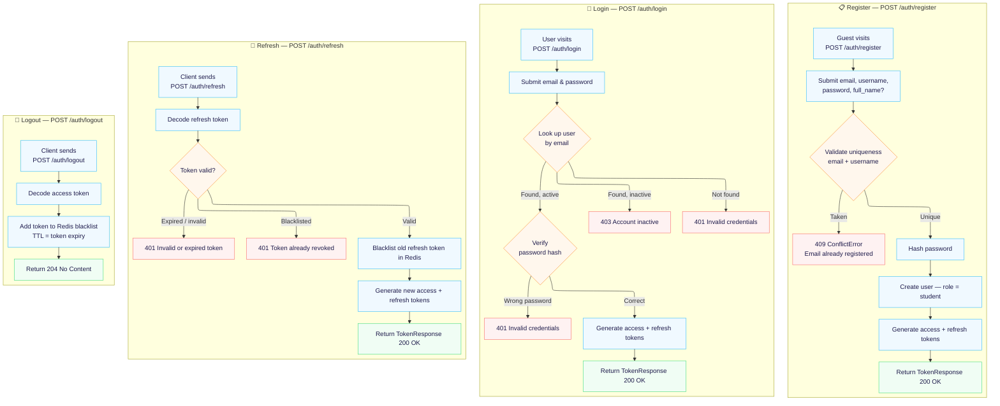

---

### F2 — User Profile Management

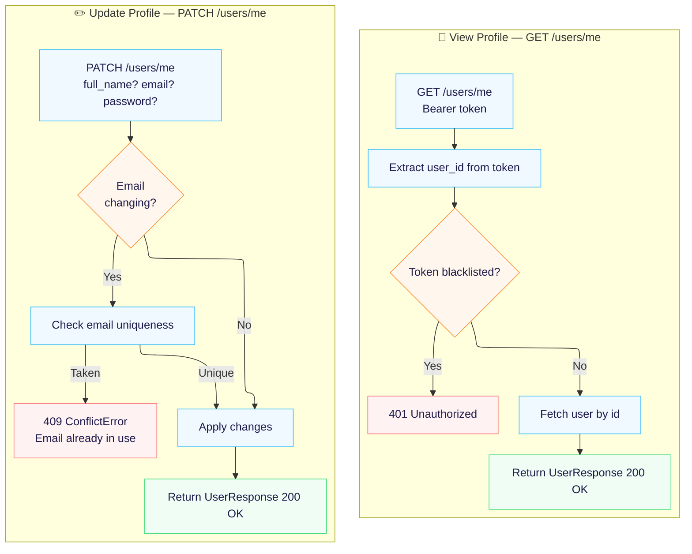

---

### F3 — Course Management

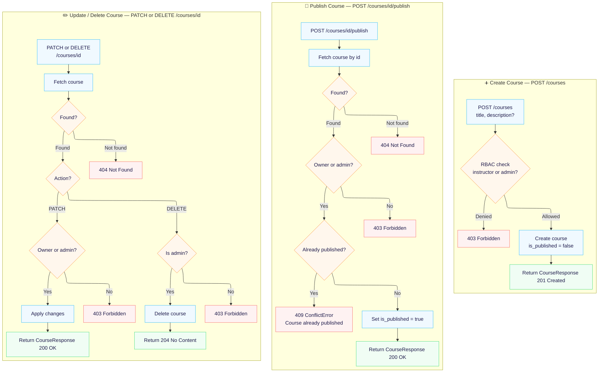

---

### F4 — Course Discovery & Enrollment

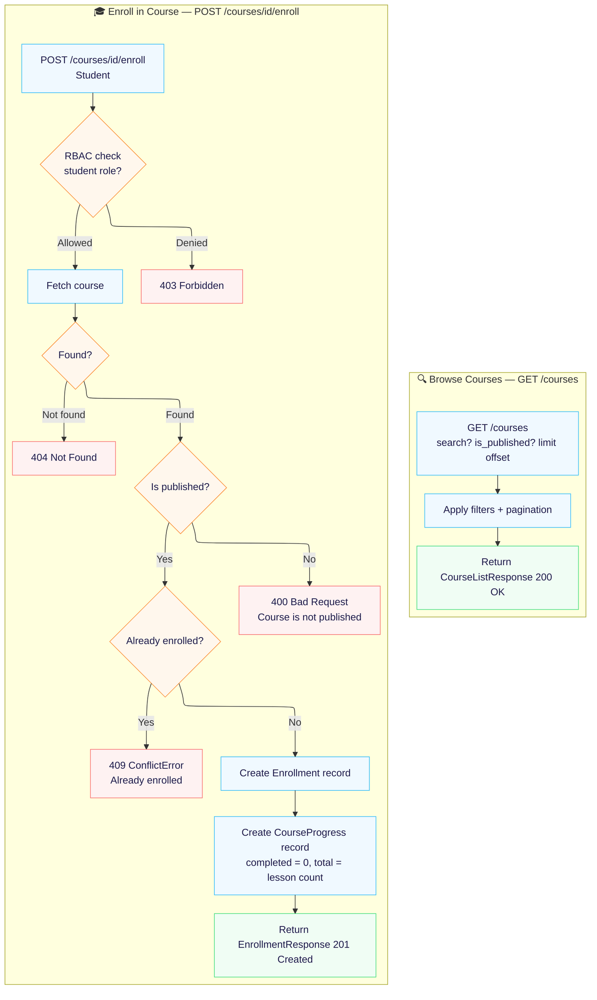

---

### F5 — Lesson Management

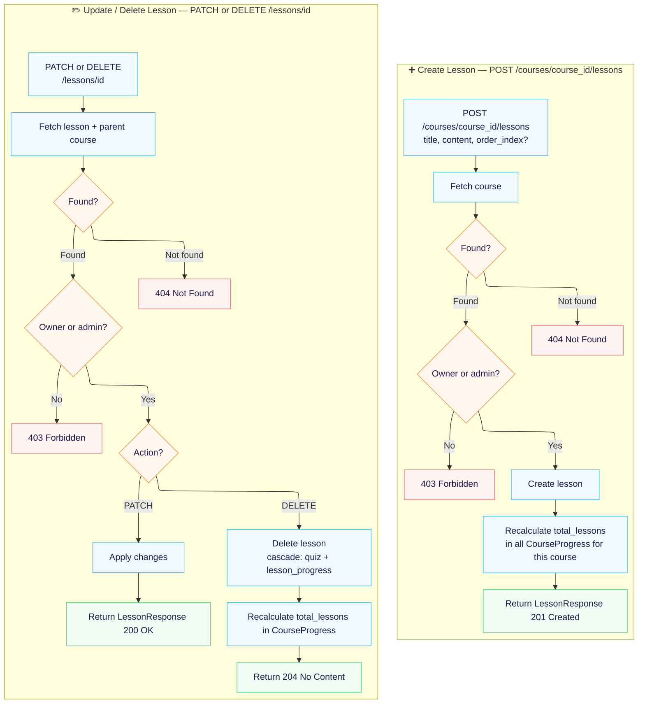

---

### F6 — Lesson Viewing & Auto-Completion

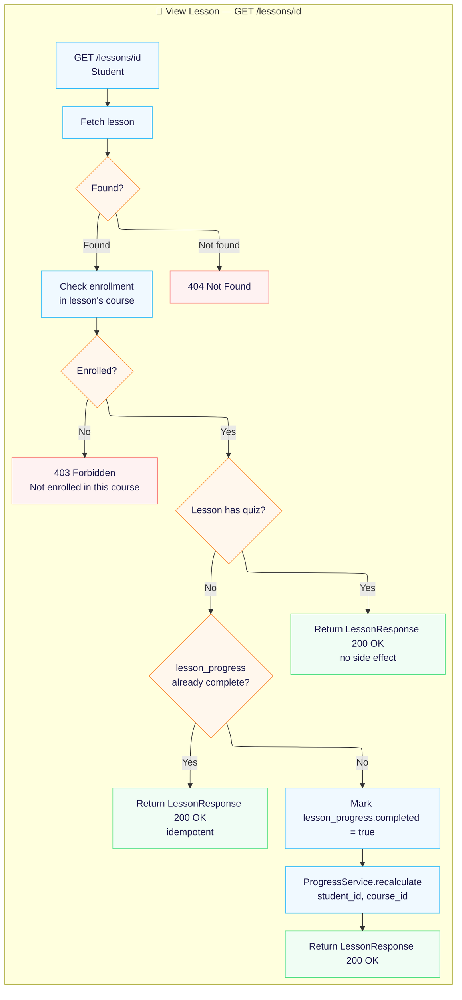

---

### F7 — Quiz & Question Management

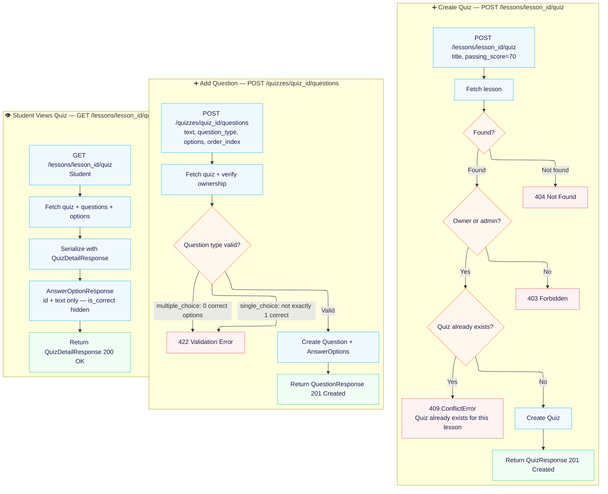

---

### F8 — Quiz Taking & Auto-grading

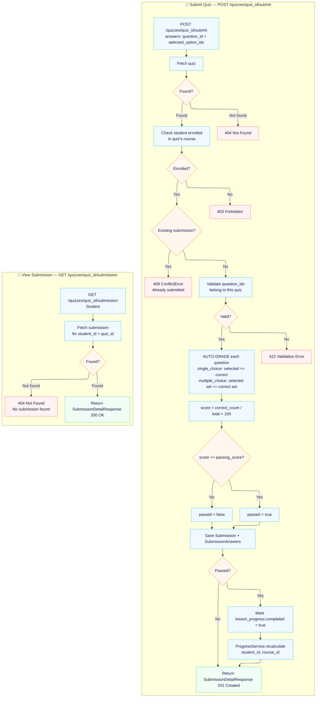

---

### F9 — Progress Tracking

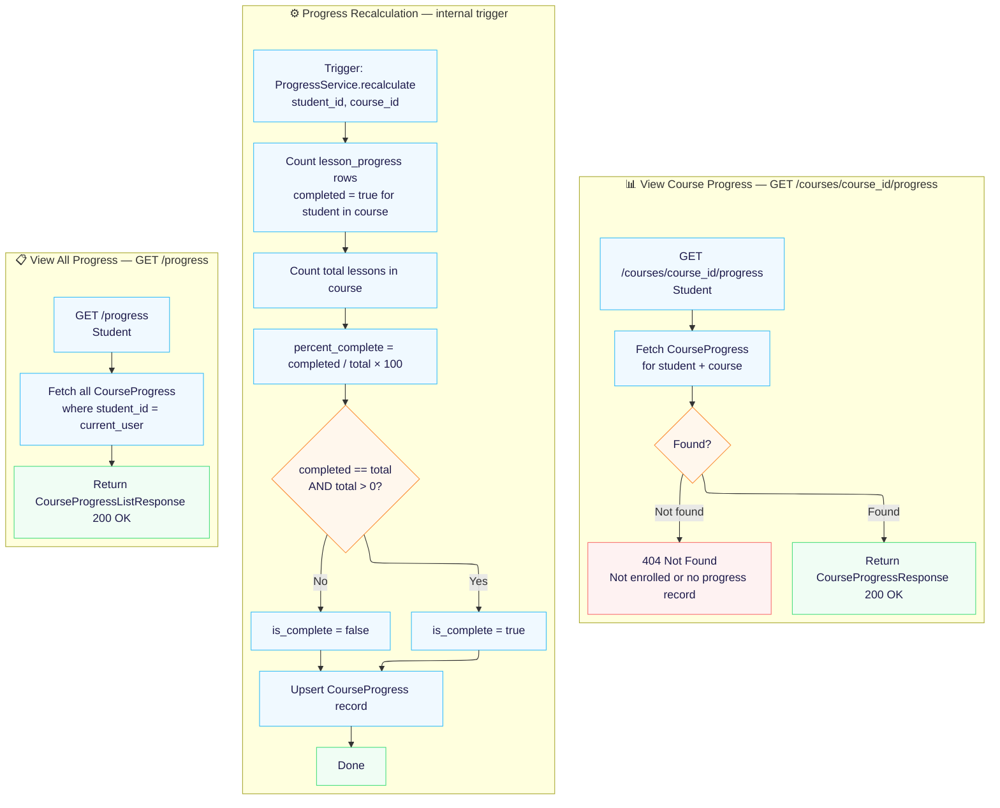

---

### F10 — Admin Panel

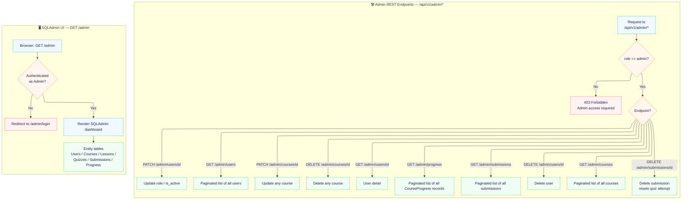

---

## Entity Relationship Diagram (ERD)

> **Legend**
> - `PK` — Primary Key (UUID)
> - `FK` — Foreign Key
> - `UNIQUE` — Unique constraint
> - `[]` — Array type (PostgreSQL `UUID[]`)

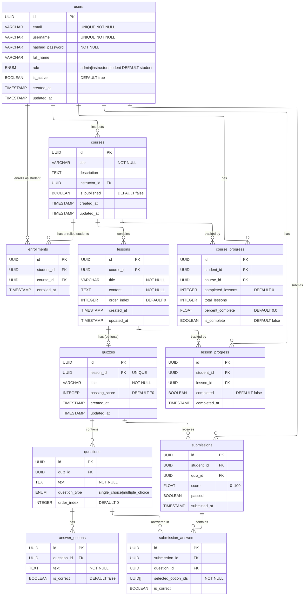

